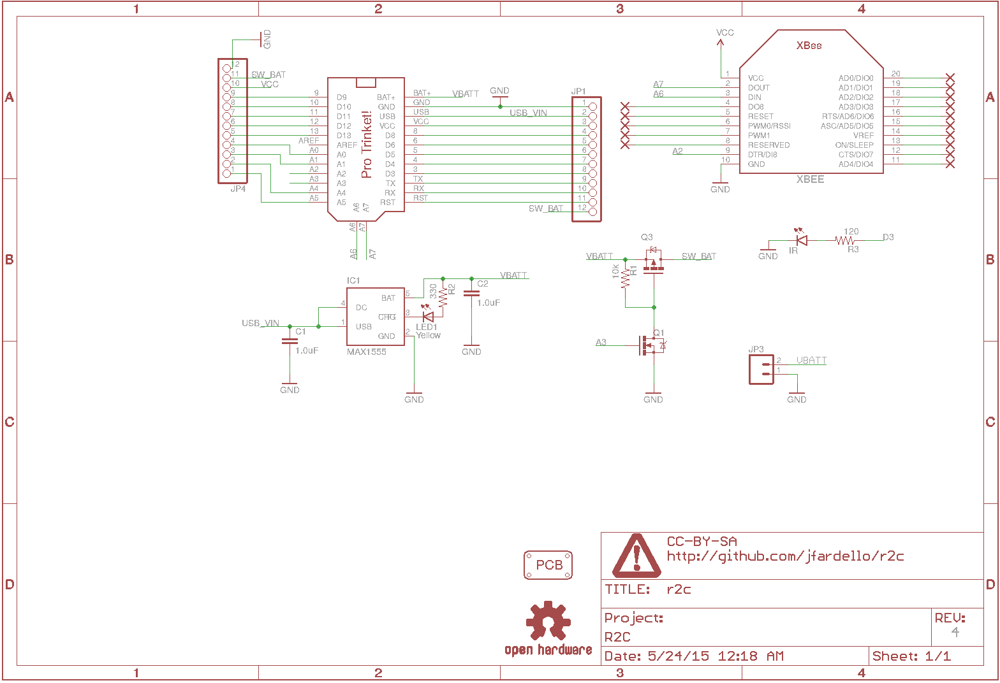

===
r2c
===

**This is a completely untested trinket "shield".**

The remote remote controller, aka ``r2c`` is lipo charger for the 3v pro trinket
arduino-compatible device, it has a switched battery output that provides 
power managent features, an optional infraref diode connected to D3 pin, and an XBEE
socket connected to A7 and A6, (not the HW serial, you can't program the trinket
through the air with this)

  

